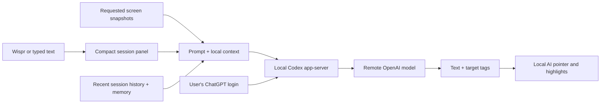

# Architecture

OpenClicky is a native macOS interface, not an LLM running on the Mac.
The current default reasoning path uses OpenAI remotely through a local Codex app-server and the user's own ChatGPT login.

## Input and display

`MenuBarPromptWindowManager` owns one borderless panel with a native multiline editor.
Native first-responder focus prepares it for Wispr.
The editor grows up to its configured height bound, then scrolls.
The same panel can show the selected session's history.
Submission closes the input before continuing the session.

`CompanionResponseOverlay` displays the answer beside the AI cursor's location.
`ReplyBubblePlacement` computes edge-safe placement.
`ReplyVisibilityPolicy` suppresses late streamed chunks after manual dismissal.
The pointer renderer and annotation layers live in `OverlayWindow`.
The persistent notch surface and sidebar dock are suppressed by `OpenClickyPresentationPolicy`.

## Context is assembled, not inherited from the account

The normal screen-answer path packages the submitted prompt, requested screen images, recent OpenClicky conversation, local memory, app instructions, and available foreground-app skill context.
Images are supplied as actual `localImage` inputs to Codex, not only mentioned as filesystem paths.
Screenshot coordinates are mapped back to desktop coordinates for display.

The local tutor-style history is bounded to the latest 24 transcript entries.
The memory helper includes up to 6,000 characters by default.
The remote screen-answer thread is ephemeral and kept warm while the app runs; after restart, local saved context reconstructs continuity.
Explicit agent tasks use their own sessions and transcripts.
The compact history panel displays a snapshot refreshed when opened.

Signing in does not import the user's ChatGPT chats, the Codex desktop app's current conversation, every local file, or a private learning curriculum.
Project-specific context requires explicit maintenance or an integration.
The screen-answer path has a read-only policy and a separate `TutorWorkspace` working directory.
Those historical internal names describe one implementation path, not the app's scope as a general companion.

## Providers and billing

`CompanionManager+AIResponsePipeline` selects among implemented provider adapters.
The Codex provider uses a Codex session.
The OpenAI adapter tries Codex first for non-speech responses and may fall back to an API key when configured.
The Claude adapter prefers its local SDK/sign-in path and may fall back to an Anthropic API key.
Apple's local adapter is text-only and does not preserve the same vision capability.
Realtime speech and other upstream integrations have their own requirements.

A provider change does not transfer an existing remote thread to another company.
Local recent history and memory can still be packaged into the new request.
The UI and Wispr input can remain the same, but screen quality, tags, tools, access, and cost depend on the backend.
An arbitrary provider is not automatically supported.

The default runtime uses cached Codex authentication, with OpenClicky's home linking to the user's default local auth file when available.
OpenClicky model preferences remain separate from Codex desktop model choices.
ChatGPT-backed usage is subject to Codex account limits; API-key requests use separate provider billing.
See [official authentication documentation](https://learn.chatgpt.com/docs/auth) and [app-server documentation](https://learn.chatgpt.com/docs/app-server).

## Explicit agent tasks

Tools → New OpenAI Task starts a separate Codex task.
Clicking its menu bar icon selects its transcript and follow-up target.
Command + Option continues the selected target while the app is running.
Selecting the normal OpenClicky task returns to the screen-answer session.
The selection is in memory and is not guaranteed to survive restart.

Explicit agent tasks can use broader tools and workspace-write or full-access policies depending on their configuration.
They must not be treated as equivalent to the read-only screen-answer path.
This fork retains substantial upstream functionality; optional integrations are not all validated in the default workflow.
